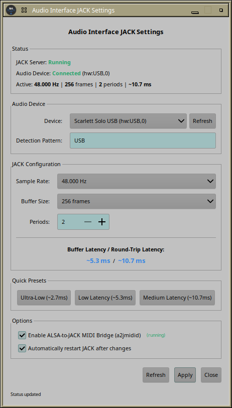

# MOTU M4 JACK Automation System for Ubuntu Studio

Automatic JACK audio server management for the MOTU M4 USB audio interface. Starts and stops JACK based on hardware detection and user login status.


## Features

- **Automatic JACK start/stop** when MOTU M4 is connected/disconnected
- **Hot-plug support** - connect M4 anytime, JACK starts automatically
- **Boot detection** - JACK starts after login if M4 is already connected
- **Flexible JACK configuration** - customize sample rate, buffer size, and periods
- **Optional A2J MIDI bridge** - control ALSA-to-JACK MIDI bridge (disabled by default for modern DAWs)
- **GTK3 GUI** for easy configuration with live latency calculation
- **Quick presets** - Low, Medium, and Ultra-Low latency with one click
- **Passwordless operation** via polkit for audio group members

## Quick Start

```bash
# 1. Clone the repository
git clone https://github.com/giang17/motu-m4-jack-starter.git
cd motu-m4-jack-starter

# 2. Run the installer (installs everything)
sudo ./install.sh

# 3. Configure JACK (optional - default is 48kHz, 256 frames, 3 periods)
sudo motu-m4-jack-setting-system.sh --rate=48000 --period=256 --nperiods=3 --restart
```

The installer automatically sets up all scripts, UDEV rules, GUI, polkit rules, and systemd services.

For manual installation, see [INSTALL.md](INSTALL.md).

## JACK Configuration

### Flexible Configuration (v2.0)

Configure any combination of sample rate, buffer size, and periods:

```bash
# Custom configuration
sudo motu-m4-jack-setting-system.sh --rate=96000 --period=128 --nperiods=2 --restart

# Show current configuration
sudo motu-m4-jack-setting-system.sh current

# Show all options
sudo motu-m4-jack-setting-system.sh help
```

### Valid Values

| Parameter | Valid Values |
|-----------|--------------|
| Sample Rate | 22050, 44100, 48000, 88200, 96000, 176400, 192000 Hz |
| Buffer Size | 16, 32, 64, 128, 256, 512, 1024, 2048, 4096 frames |
| Periods | 2 - 8 |

### Quick Presets

For convenience, presets are still available:

| Preset | Sample Rate | Buffer | Periods | Latency | Use Case |
|--------|-------------|--------|---------|---------|----------|
| 1 - Low | 48 kHz | 128 | 2 | ~5.3 ms | General audio work |
| 2 - Medium | 48 kHz | 256 | 2 | ~10.7 ms | Stable, recommended |
| 3 - Ultra-Low | 48 kHz | 64 | 2 | ~2.7 ms | Optimized systems only |

```bash
# Use preset (legacy syntax still works)
sudo motu-m4-jack-setting-system.sh 2 --restart
```

### Latency Calculation

```
Latency (ms) = (Buffer Size × Periods) / Sample Rate × 1000
```

## ALSA-to-JACK MIDI Bridge

The GUI includes a toggle for the ALSA-to-JACK MIDI bridge (`a2jmidid`):

☑ **Enable ALSA-to-JACK MIDI Bridge (a2jmidid)**

**Default: disabled** - Recommended for modern DAWs like Bitwig Studio and Reaper, which access ALSA MIDI directly and may show "device busy" errors when a2jmidid is running.

**Enable it if you:**
- Use hardware MIDI controllers that only appear in ALSA
- Need MIDI routing within JACK (visible in Patchance/Carla)
- Use older software that expects JACK MIDI ports

**How to use:**
1. Open the GUI (`motu-m4-jack-gui.py`)
2. Check/uncheck "Enable ALSA-to-JACK MIDI Bridge"
3. Click "Apply"

The status indicator shows whether a2jmidid is currently **(running)** or **(stopped)**.

When enabled, the bridge uses `--export-hw` flag to keep hardware ports available for both JACK and ALSA applications.

See [INSTALL.md](INSTALL.md#alsa-to-jack-midi-bridge-a2j) for more details.

## GUI

Start the GUI via terminal or application menu:

```bash
motu-m4-jack-gui.py
```

Or find it in: **Audio/Video → MOTU M4 JACK Settings**



### GUI Features

- **Sample Rate dropdown** - Select from 22050 Hz to 192000 Hz
- **Buffer Size dropdown** - Select from 16 to 4096 frames
- **Periods spinner** - Adjust from 2 to 8 periods
- **Live latency calculation** - See latency update as you change settings
- **Quick preset buttons** - One-click Low, Medium, Ultra-Low latency
- **Status monitoring** - JACK server and hardware connection status
- **Auto-restart option** - Apply changes and restart JACK immediately

## Documentation

See [INSTALL.md](INSTALL.md) for:
- Detailed installation instructions
- Configuration options
- Troubleshooting guide
- Technical details

## Requirements

- Ubuntu Studio 24.04+
- MOTU M4 USB Audio Interface
- Pipewire with JACK compatibility
- Python 3 + GTK3 (for GUI)

## Changelog

See [CHANGELOG.md](CHANGELOG.md) for detailed version history.

For release notes with download links, see [GitHub Releases](https://github.com/giang17/motu-m4-jack-starter/releases).

## License

GPL-3.0-or-later - See [LICENSE](LICENSE)

---

**Status**: Production Ready ✅